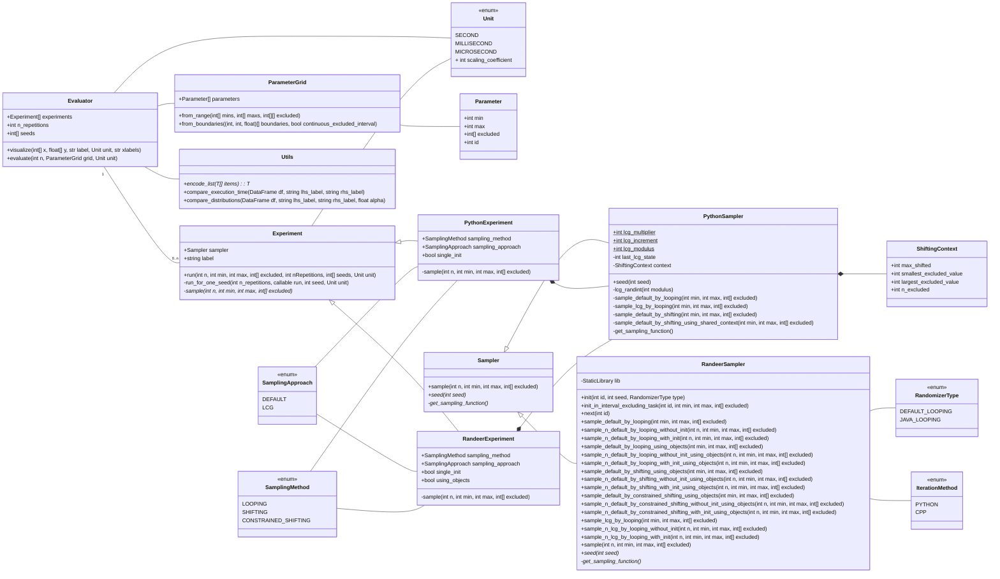
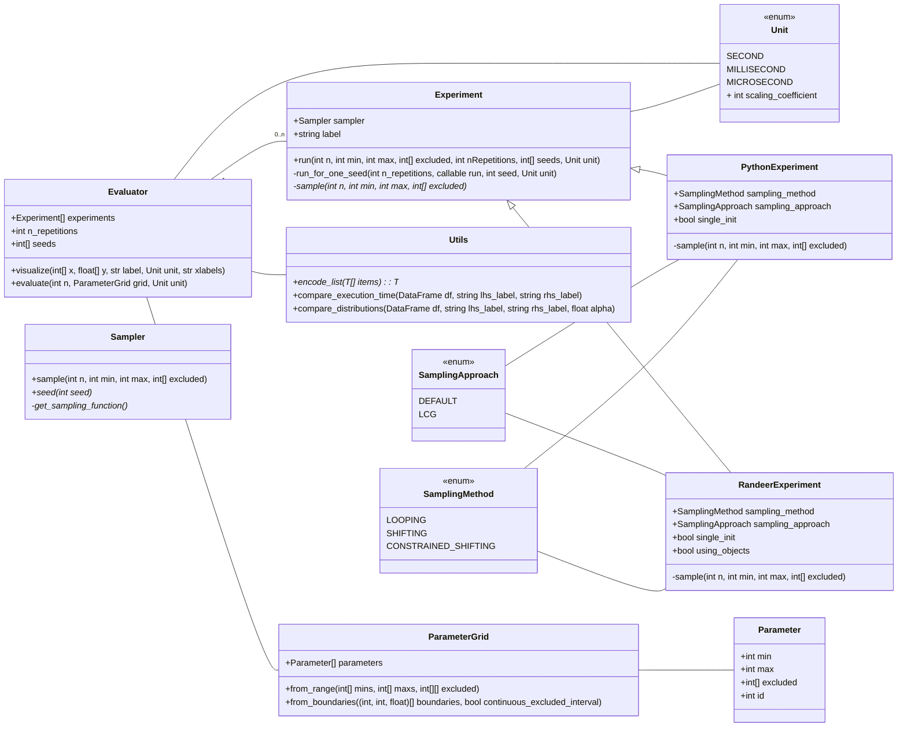
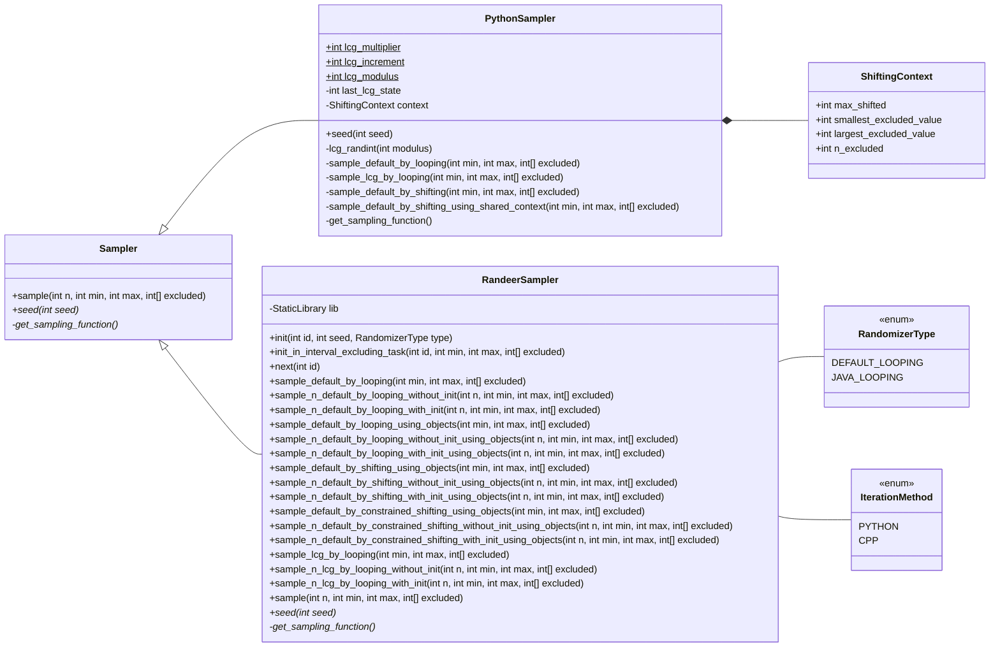

# errand

<p align="center">
    
</p>

Evaluation of random number generation functions performance

## Create environment

Use requirements file to create a `conda` environment:

```sh
conda env create -f environment.yml
```

## Run evaluation

Execute preliminary tests:

```sh
python -m errand randomize
```

## Architecture

The following UML class diagram describes structure of the package:



The diagram below demonstrates a shorter version of the same diagram without sampling classes:



Conversely, the following diagram contains all classes related to sampling:


