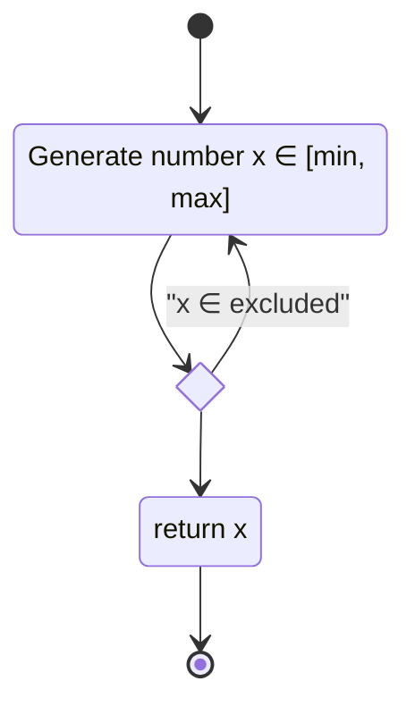
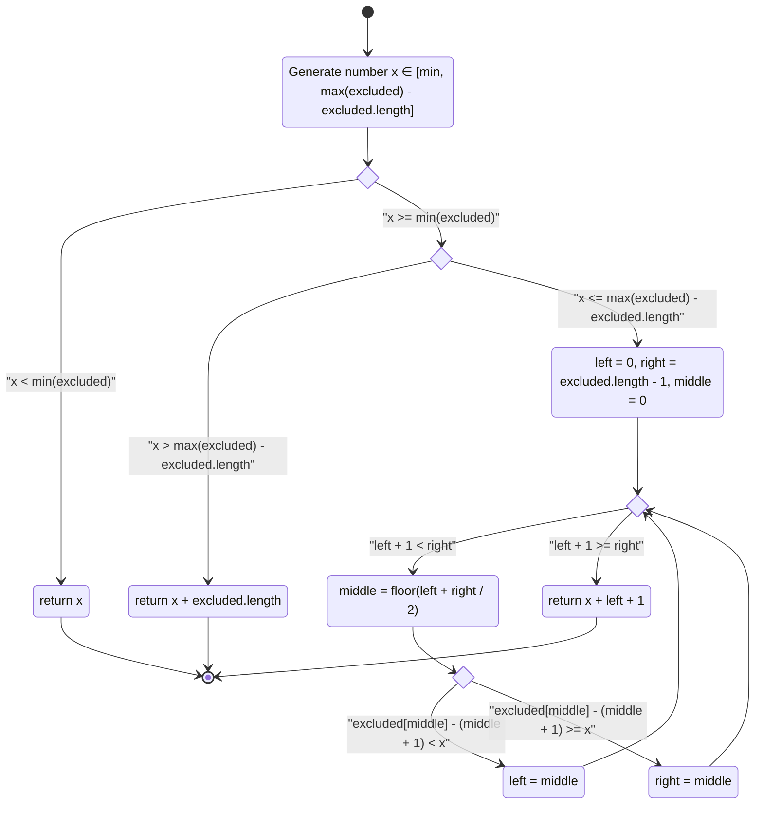
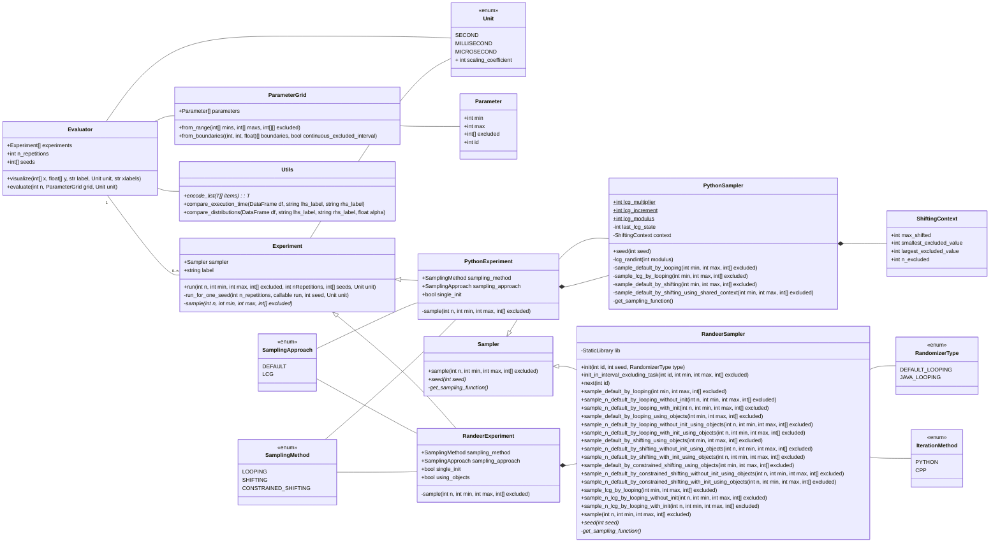

# errand

<p align="center">
    
</p>

Evaluation of random number generation functions performance

There are basically two types of randomizers which are evaluated in this package. The first one allows to sample random numbers in the interval `[min, max]`, excluding elements which are passed as components of the `excluded` array using a simple loop-based algorithm:



An alternative algorithm implements the same thing, but does it without a need to repeat the sampling procedure. The algorithm is much more complex, but essentially it is just choosing the right offset which should be added to the generated x in order to not to obtain a forbidden value. The offset is equal to the number of excluded values before the shifted value of x:



## Create environment

Use requirements file to create a `conda` environment:

```sh
conda env create -f environment.yml
```

## Run evaluation

Execute preliminary tests:

```sh
python -m errand randomize
```

## Architecture

The following UML class diagram describes structure of the package:



The diagram below demonstrates a shorter version of the same diagram without sampling classes:


Conversely, the following diagram contains all classes related to sampling:


